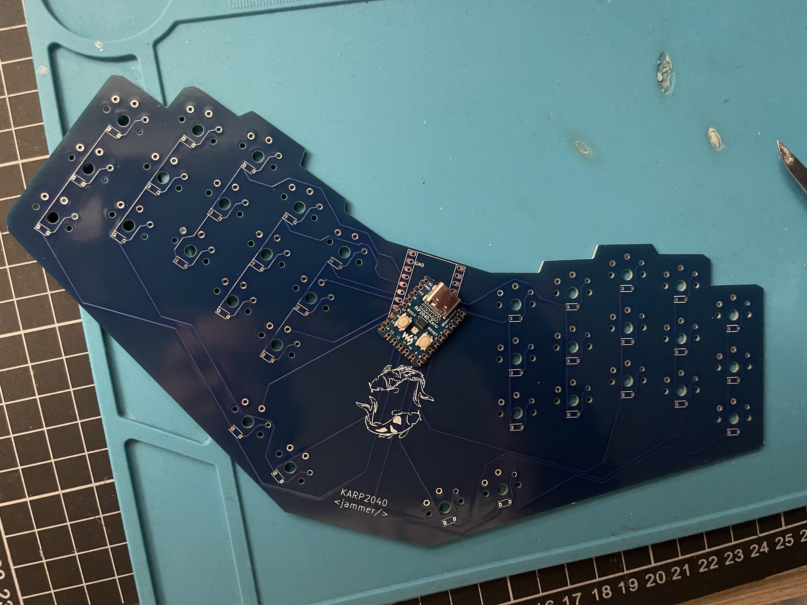

# KaRP2040

A basic no-frills 34-key, wired unibody-split keyboard with the RP2040-Zero module running KMK

## Components

* Waveshare RP2040-Zero
* 34 Kailh-choc switches 
* 34 SMD diode SOD-123 (1N4148)
* 34 keycaps
* PCB (gerber files available in this repo)

## A bit of backstory

I had recently built a couple of wireless split keyboards using the Seeeduino Xiao BLE running ZMK. When I went on a trip home, I decided it
was a perfect time to test them out as a small form-factor travel keyboard. While I did enjoy how easy it was to slip into my bag, I found I was connecting the master-side to the computer more often than I wanted either to reconnect via bluetooth, or needing to recharge the battery.
It was at this point that I started thinking about building a wired unibody. I had been wanting to use KMK with the RP2040 chip for a while now, and had a few modules lying around. Coincidentally, around the same time I found Ben Vallack's video where he went in the same direction of a unibody for his originally split design.
So when PCBWay generously offered to sponsor my next keyboard design, I jumped at the chance to build the KaRP2040. 

As with all my previous boards, this has barebones functionality. No RGB lignts, LED or knobs. This is mostly to keep the costs down, but also because from past experience, I would most likely just use those features for the first few hours before turning them off forever.

## Build

This is a very basic build. Solder on the diodes as shown on the silkscreen. The board was designed with reversible component footprints, so theoretically you could use either side of the PCB. However, the firmware included in this repo was programmed with the configuration shown in the pictures, having the logo side up. You may need to fiddle with the diode orientation settings in `kb.py` if you decided to build this the other way around.

## Firmware

This board uses KMK and CircuitPython. If you want to write your own firmware for this, you can follow the excellent instructions
on the [KMK webite](https://github.com/KMKfw/kmk_firmware/blob/master/docs/en/Getting_Started.md).

### How to install the included keymap and firmware

* Download CircuitPython for RP2040-Zero from [here](https://circuitpython.org/board/waveshare_rp2040_zero/)
* Hold down the `Boot` button then press `Reset` to go into bootloader mode.
* The `CIRCUITPY` folder will rename itself to something like `RP2040`
* Copy over the *.uf2 file you downloaded previously into the `RP2040` folder. After this process completes, the directory will reload and you will see `CIRCUITPY` on your desktop again.
* Get a [copy of KMK](https://github.com/KMKfw/kmk_firmware/archive/refs/heads/master.zip) from here.
* Copy the `kmk` folder to `CIRCUITPY`
* Delete the `code.py` or `main.py` file you find in the `CIRCUITPY` folder
* Copy the contents of the `kmk` folder in this repo to the `CIRCUITPY` folder

## More pictures

